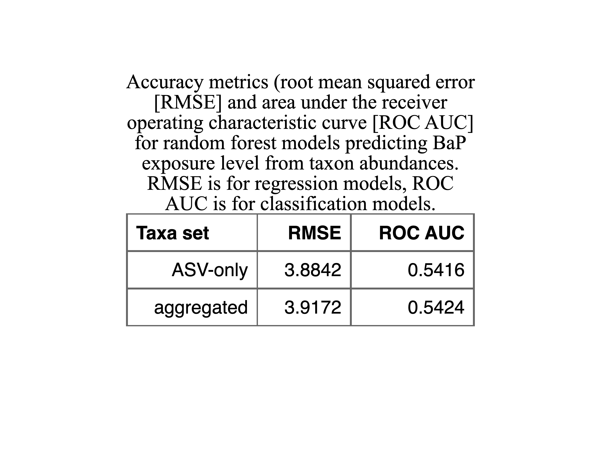

```{r setup, include=FALSE}
source("Analysis/00_setup.R")
theme_set(theme_cowplot())
source(file.path(dirs$scripts, "poster_cowplot_tweaks.R"))
dirs$analysis <- "Analysis"
dirs$poster <- "Poster_figures"
img.dpi <- 300
img.width <- 10
img.height <- 10
cap.width <-  110
knitr::opts_chunk$set(
  echo = FALSE,
  cache = FALSE,
  warning = FALSE,
  message = FALSE,
  dpi = img.dpi
)
transparent <- rgb(0, 0, 0, 0)
bap.colors <- brewer.pal(11, "RdYlGn")[c(11, 4, 3, 1)]
bap.color.scale <- scale_color_manual(
  name = "BaP (µM)", 
  values = bap.colors,
  na.value = transparent,
  breaks = c(0, 1, 5, 10)
)

bap.fill.scale <- scale_fill_manual(name = "BaP (µM)", values = bap.colors)
auc.colors <- colorRampPalette(brewer.pal(9, "YlGnBu")[-1])(104) %>% rev()
sig.colors <- brewer.pal(9, "Blues")[c(8, 6)]
plot.ext <- c(".pdf")

# source analysis files
list.files(path = dirs$analysis, full.names = T) %>%
  str_subset(pattern = "00", negate = T) %>% 
  walk(source)

# timepoints that bound epochs
epoch.dt <- data.table(
  Epoch = c("E1", "E2", "E3"),
  Start = c(61, 120, 180),
  End = c(89, 149, 209)
)

```

```{r cvcvzgf-1}

lpr.move.dt <- readRDS(file.path(dirs$input, "cv_cvz_gf_LPR_base_dt.rds")) %>%
  merge(. , microbiome.plate.treat, by = "Plate.ID")

# easier plotting of lpr aucs by cycle
lpr.auc.plot.dt <- melt(
  cvcvzgf.dt, 
  id.vars = c("Sample", "BaP_uM", "Microbiome"), 
  measure.vars = str_subset(names(cvcvzgf.dt), "LPR.(dark|light).auc"),
  variable.name = "Cycle",
  value.name = "AUC"
)
lpr.auc.plot.dt[
  , Cycle := str_remove_all(Cycle, "LPR.|.auc") %>%
    factor(levels = c("light", "dark"))
]

list(
  { # lpr movement by time
    ggplot(
      lpr.move.dt[Timepoint >= epoch.dt$Start[1]], 
      aes(x = Timepoint, y = Movement)
    ) + 
      geom_segment(
        data = epoch.dt,
        y = -0.1, yend = -0.1,
        aes(x = Start, xend = End),
        color = "yellow",
        size = 3
      ) +
      stat_summary(
        fun.data = "mean_cl_boot", 
        geom = "ribbon",
        aes(fill = as.factor(BaP.uM)),
        alpha = 0.3
      ) +
      bap.fill.scale +
      stat_summary(
        fun = mean, 
        geom = "line", 
        aes(color = as.factor(BaP.uM))
      ) + 
      bap.color.scale + 
      scale_x_continuous(expand = c(0, 0)) + 
      labs(y = "Movement (mm)") + 
      background_grid(major = "y", minor = "y") + 
      facet_wrap(~ Microbiome)
  },
  { # lpr movement auc by bap
    ggplot(lpr.auc.plot.dt, aes(x = BaP_uM, y = AUC)) + 
      geom_quasirandom(aes(color = as.factor(BaP_uM)), show.legend = F) + 
      stat_summary(
        fun.data = "mean_cl_boot", 
        geom = "errorbar"
      ) + 
      stat_smooth(
        method = "lm", 
        formula = y ~ x + I(x^2), 
        color = "black", 
        linetype = 2,
        size = 0.5,
        se = FALSE
      ) +
      bap.color.scale + 
      scale_x_continuous(breaks = c(0, 1, 5, 10)) +
      facet_grid(Cycle ~ Microbiome) + 
      labs(y = "AUC (mm × time)", x = "BaP (µM)") + 
      background_grid(major = "y", minor = "y")
  }
) %>%
  plot_grid(
    plotlist = ., 
    ncol = 1, 
    align = "v", 
    axis = "l", 
    rel_heights = c(1, 1.5)
  ) %>%
  ggsave(
    filename = file.path(dirs$poster, paste0("cvcvzgf_lpr", plot.ext)),
    width = img.width,
    height = img.height * 1.2,
    dpi = img.dpi
  )
```

```{r cvcvzgf-2}

lpr.move.dt <- readRDS(file.path(dirs$input, "cv_cvz_gf_LPR_base_dt.rds")) %>%
  merge(. , microbiome.plate.treat, by = "Plate.ID")
# timepoints that bound epochs
epoch.dt <- data.table(
  Epoch = c("E1", "E2", "E3"),
  Start = c(61, 120, 180),
  End = c(89, 149, 209)
)

# easier plotting of lpr aucs by cycle
lpr.auc.plot.dt <- melt(
  cvcvzgf.dt, 
  id.vars = c("Sample", "BaP_uM", "Microbiome"), 
  measure.vars = str_subset(names(cvcvzgf.dt), "LPR.(dark|light).auc"),
  variable.name = "Cycle",
  value.name = "AUC"
)
lpr.auc.plot.dt[
  , Cycle := str_remove_all(Cycle, "LPR.|.auc") %>%
    factor(levels = c("light", "dark"))
]

list(
  { # lpr movement by time
    ggplot(
      lpr.move.dt[Timepoint >= epoch.dt$Start[1]], 
      aes(x = Timepoint, y = Movement)
    ) + 
      geom_segment(
        data = epoch.dt,
        y = -0.1, yend = -0.1,
        aes(x = Start, xend = End),
        color = "yellow",
        size = 3
      ) +
      # stat_summary(
      #   fun.data = "mean_cl_boot", 
      #   geom = "ribbon",
      #   aes(fill = as.factor(BaP.uM)),
      #   alpha = 0.3
      # ) +
      # bap.fill.scale +
      stat_summary(
        fun = mean, 
        geom = "line", 
        aes(color = as.factor(BaP.uM), linetype = Microbiome)
      ) + 
      bap.color.scale + 
      scale_x_continuous(expand = c(0, 0)) + 
      labs(y = "Movement (mm)") + 
      background_grid(major = "y", minor = "y")
  },
  { # lpr movement auc by bap
    ggplot(lpr.auc.plot.dt, aes(x = BaP_uM, y = AUC)) + 
      geom_quasirandom(
        aes(color = as.factor(BaP_uM), shape = Microbiome), 
        show.legend = F,
        dodge = 1
      ) + 
      stat_summary(
        fun.data = "mean_cl_boot", 
        geom = "errorbar",
        aes(group = Microbiome),
        position = position_dodge(width = 1)
      ) + 
      stat_smooth(
        aes(linetype = Microbiome),
        method = "lm",
        formula = y ~ x + I(x^2),
        color = "black",
        # linetype = 2,
        size = 0.5,
        se = FALSE
      ) +
      bap.color.scale + 
      scale_x_continuous(breaks = c(0, 1, 5, 10)) +
      facet_wrap(~ Cycle, nrow = 1) +
      labs(y = "AUC (mm × time)", x = "BaP (µM)") + 
      background_grid(major = "y", minor = "y")
  }
) %>%
  plot_grid(
    plotlist = ., 
    nrow = 1, 
    align = "h", 
    axis = "tb", 
    rel_widths = c(1.5, 1)
  ) %>%
  ggsave(
    filename = file.path(dirs$poster, paste0("cvcvzgf2_lpr", plot.ext)),
    width = img.width * 1.2,
    height = img.height * 0.6,
    dpi = img.dpi
  )
```

```{r bapOnly-movement-plots, cache=TRUE}
# read in data
epr.move.dt <- readRDS(file.path(dirs$save, "EPR_base_dt.rds"))
lpr.move.dt <- readRDS(file.path(dirs$save, "LPR_base_dt.rds"))

list(
  { # epr movement by time
    ggplot(epr.move.dt[Timepoint > 19], aes(x = Timepoint, y = Movement)) + 
      stat_summary(
        fun.data = "mean_cl_boot",
        geom = "ribbon", 
        aes(fill = as.factor(BaP.uM)), 
        alpha = 0.3, 
        show.legend = F
      ) +
      stat_summary(
        fun = mean, 
        geom = "line", 
        aes(color = as.factor(BaP.uM))
      ) +
      bap.fill.scale +
      bap.color.scale +
      geom_vline(xintercept = c(30, 40), linetype = 2, color = "gray10") +
      scale_x_continuous(expand = c(0, 0), n.breaks = 6) +
      labs(y = "Movement (mm)", x = "Timepoint (s)")  + 
      background_grid(major = "y", minor = "y")
  },
  { # epr movement auc by bap
    ggplot(sample.dt, aes(x = BaP_uM, y = EPR.auc)) + 
      geom_quasirandom(aes(color = as.factor(BaP_uM))) + 
      stat_summary(
        fun.data = "mean_cl_boot", 
        geom = "errorbar"
      ) + 
      stat_smooth(
        method = "lm", 
        formula = y ~ x, 
        color = "black", 
        linetype = 2,
        size = 0.5,
        se = FALSE
      ) +
      bap.color.scale + 
      scale_x_continuous(breaks = c(0, 1, 5, 10)) +
      labs(y = "AUC (mm × time)", x = "BaP (µM)") + 
      theme(legend.position = "none") + 
      background_grid(major = "y", minor = "y")
  }
) %>%
  plot_grid(
    plotlist = ., 
    nrow = 1, 
    align = "h", 
    axis = "tb", 
    rel_widths = c(1.5, 1)
  ) %>%
  ggsave(
    filename = file.path(dirs$poster, paste0("bapOnly_epr", plot.ext)),
    width = img.width,
    height = img.height * 0.6,
    dpi = img.dpi
  )

# timepoints that bound epochs
epoch.dt <- data.table(
  Epoch = c("E1", "E2", "E3"),
  Start = c(61, 120, 180),
  End = c(89, 149, 209)
)

# easier plotting of lpr aucs by cycle
lpr.auc.plot.dt <- melt(
  sample.dt, 
  id.vars = c("Sample", "BaP_uM"), 
  measure.vars = str_subset(names(sample.dt), "LPR.(dark|light).auc"),
  variable.name = "Cycle",
  value.name = "AUC"
)
lpr.auc.plot.dt[
  , Cycle := str_remove_all(Cycle, "LPR.|.auc") %>%
    factor(levels = c("light", "dark"))
]

list(
  { # lpr movement by time
    ggplot(
      lpr.move.dt[Timepoint >= epoch.dt$Start[1]], 
      aes(x = Timepoint, y = Movement)
    ) + 
      geom_segment(
        data = epoch.dt,
        y = -0.1, yend = -0.1,
        aes(x = Start, xend = End),
        color = "yellow",
        size = 3
      ) +
      stat_summary(
        fun.data = "mean_cl_boot", 
        geom = "ribbon",
        aes(fill = as.factor(BaP.uM)),
        alpha = 0.3
      ) +
      bap.fill.scale +
      stat_summary(
        fun = mean, 
        geom = "line", 
        aes(color = as.factor(BaP.uM))
      ) + 
      bap.color.scale + 
      scale_x_continuous(expand = c(0, 0)) + 
      labs(y = "Movement (mm)") + 
      background_grid(major = "y", minor = "y")
  },
  { # lpr movement auc by bap
    ggplot(lpr.auc.plot.dt, aes(x = BaP_uM, y = AUC)) + 
      geom_quasirandom(aes(color = as.factor(BaP_uM)), show.legend = F) + 
      stat_summary(
        fun.data = "mean_cl_boot", 
        geom = "errorbar"
      ) + 
      stat_smooth(
        method = "lm", 
        formula = y ~ x + I(x^2), 
        color = "black", 
        linetype = 2,
        size = 0.5,
        se = FALSE
      ) +
      bap.color.scale + 
      scale_x_continuous(breaks = c(0, 1, 5, 10)) +
      facet_wrap(~ Cycle, nrow = 1) + 
      labs(y = "AUC (mm × time)", x = "BaP (µM)") + 
      background_grid(major = "y", minor = "y")
  }
) %>%
  plot_grid(
    plotlist = ., 
    nrow = 1, 
    align = "h", 
    axis = "tb", 
    rel_widths = c(1.5, 1)
  ) %>%
  ggsave(
    filename = file.path(dirs$poster, paste0("bapOnly_lpr", plot.ext)),
    width = img.width * 1.2,
    height = img.height * 0.6,
    dpi = img.dpi
  )
```


> [Full size](Plots/bapOnly_epr_lpr.png). (A) EPR movement data. The lines show the mean movement (mm) for zebrafish embryos for each B*a*P exposure level (in µM). The shaded ribbons indicate 95% C.I.s for the means. The black dotted lines indicate the window of time on which later statistical analysis are based. (B) Areas under the curve (AUCs) for the movement curves from panel A, measured only in the window between the dotted lines. Black error bars indicate the 95% C.I.s for the mean AUC per B*a*P exposure level. The blue dotted line indicates the estimated association from linear regression. (C) LPR movement data. The lines show the mean movement (mm) for zebrafish larvae for each B*a*P exposure level (in µM). The shaded ribbons indicate 95% C.I.s for the means. The yellow segments near the x-axis indicate which time points fall within light cycles (the rest of the time points are in dark cycles). (D) AUCs for the movement curves from panel C, splite by cycle. Black error bars indicate the 95% C.I.s for the mean AUC per B*a*P exposure level. The blue dotted line indicates the estimated association from polynomial linear regression. (E) Differential Entropy values (DE; log-transformations of difference in 95th and 5th percentiles of movement per treatment per plate). Each line represents the sum of the mean DE at each time point for each treatment [Σ(mean(DE) ~ B*a*P µM) ~ plate]. (F) Plot of the sum of AUC values calculated from DE against B*a*P exposure level for all light and dark cycles.


```{r bapOnly-alpha-beta-plots, cache=TRUE}
alpha.plot.dt <- melt(
  copy(sample.dt),
  measure.vars = c("Phylogenetic"),
  id.vars = c("Sample", "BaP_uM"),
  variable.name = "Alpha.metric",
  value.name = "Score"
)
sig.beta <- "Unweighted UniFrac"
beta.coord.dt <- beta.bap.ord.dts$sample.coords[Beta.method == sig.beta]
beta.vector.dt <- beta.bap.ord.dts$vector.coords[Beta.method == sig.beta]
beta.axes.labs <- beta.bap.ord.dts$axes.labs[Beta.method == sig.beta]

list(
  { # sig alphas
    ggplot(alpha.plot.dt, aes(x = BaP_uM, y = Score)) + 
      geom_quasirandom(aes(color = as.factor(BaP_uM))) + 
      stat_summary(
        fun.data = "mean_cl_boot", 
        geom = "errorbar"
      ) + 
      stat_smooth(
        method = "lm", 
        formula = y ~ x, 
        color = "black", 
        linetype = 2,
        size = 0.5,
        se = FALSE
      ) +
      bap.color.scale + 
      scale_x_continuous(breaks = c(0, 1, 5, 10)) +
      labs(
        y = "Score", 
        x = "BaP (µM)", 
        subtitle = "Phylogenetic Diversity"
      ) + 
      background_grid(major = "y", minor = "y")
  },
  { # sig betas
    ggplot(beta.coord.dt, aes(x = Axis1, y = Axis2)) + 
      geom_point(aes(color = as.factor(BaP_uM)), show.legend = F) + 
      geom_segment(
        data = beta.vector.dt, 
        aes(x = 0, y = 0, xend = Axis1, yend = Axis2),
        color = "black",
        arrow = arrow(length = unit(0.03, "npc"))
      ) +
      bap.color.scale + 
      labs(
        x = beta.axes.labs$X.lab, 
        y = beta.axes.labs$Y.lab,
        subtitle = sig.beta
      ) 
  }
) %>%
  plot_grid(
    plotlist = .,
    nrow = 1,
    rel_widths = c(1, 1.5),
    align = "h",
    axis = "tb"
  ) %>%
  ggsave(
    filename = file.path(dirs$poster, paste0("bapOnly_alpha_beta", plot.ext)),
    width = img.width,
    height = img.height * 0.6,
    dpi = img.dpi
  )
```


> [Full size](Plots/bapOnly_alpha_beta.png). (A) Significant associations between alpha-diversity metrics and B*a*P exposure (in µM). Black error bars indicate the 95% C.I.s for the mean alpha-diversity score per B*a*P exposure level. The blue dotted lines indicate the estimated association from linear regression. (B) Distance-based redundancy analysis (dbRDA) ordination based on unweighted UniFrac scores. Points are colored by B*a*P exposure level and the black arrow indicates the direction of change across the ordination and the relative magnitude of the effect. 


```{r bapOnly-random-forest-performance}
rf.perform <- bap.rmses.dt[bap.rocAUCs.dt, on = "Taxa.set"]
rf.perform[, Taxa.set := str_replace(Taxa.set, "_", "-")]
names(rf.perform) <- str_replace_all(names(rf.perform), "\\.", " ")
file.stem <- file.path(dirs$plots, "bapOnly_rf_performance")
cap <- "Accuracy metrics (root mean squared error [RMSE] and area under the receiver operating characteristic curve [ROC AUC] for random forest models predicting BaP exposure level from taxon abundances. RMSE is for regression models, ROC AUC is for classification models."
flex.tbl <- flextable(rf.perform) %>%
  set_caption(cap) %>%
  theme_box() %>%
  align(j = 1, align = "right") %>%
  colformat_double(j = 2:3, digits = 4) %>%
  autofit()
save.stat.tables(
  flex = flex.tbl, 
  filename = file.stem, 
  exts = stat.tbl.exts,
  zoom = table.zoom, 
  expand = table.expand["small"]
)
# print(flex.tbl)
```



For regression random forest models, lower root mean square (RMSE) is better, while for classification models, greater area under the receiver operating characteristic curve (ROC AUC) is better. In these cases we see that the better regression model, ASV-only, is able to predict B*a*P exposure level to within about 3.88 µM. The better classification model, using the aggregated taxon set, is roughly 54% accurate in classifying B*a*P exposure level, which, since there are four classes (0, 1, 5, and 10 µM), is not perfect, but better than chance.

We then used a permutational approach to determine which taxa were significantly important in predicting B*a*P exposure. There were 58 ASVs that were significantly important to the regression model, and 503 taxa significantly important to the classification model. We plotted the abundances of the top 20 most important taxa for the classification model. Tables of all important taxa for both models are in the supplement.

```{r bapOnly-random-forest-important-taxa-plots, cache=TRUE}
taxonomy.dt <- taxa.data.table(ps.processed) %>%
  setkey(Taxon)
impt.dt <- copy(bap.class.impt.dt) %>%
  .[Importance > 0] %>%
  .[order(Importance, decreasing = T)]
all.taxa <- impt.dt$Taxon
abund.data <- rbindlist(bap.rf.data.list$aggregated) %>%
  melt(id.vars = "BaP_uM", variable.name = "Taxon", value.name = "Abund")

plot.data.list <- NULL
i <- 0
while (length(plot.data.list) < 20) {
  i <- i + 1
  j <- length(plot.data.list) + 1
  dt <- abund.data[Taxon == all.taxa[i]]
  if (length(plot.data.list) > 0) {
    ident.abunds <- sapply(plot.data.list, function(plot.data) {
      return(identical(dt$Abund, plot.data$Abund))
    })
    if (!any(ident.abunds)) {
      plot.data.list[[j]] <- dt
    }
  } else {
    plot.data.list[[j]] <- dt
  }
}
plot.data <- rbindlist(plot.data.list)
top.taxa <- unique(plot.data$Taxon)

label.dt <- lapply(top.taxa, function(taxon) {
  if (str_detect(taxon, "ASV")) {
    label <- paste(taxonomy.dt[taxon]$Genus, taxon, sep = "|") %>%
      str_replace(
        "Allorhizobium-Neorhizobium-Pararhizobium-Rhizobium", 
        "Rhizobium"
      )
  } else {
    label <- lapply(str_split(taxon, "\\."), tail, 2)[[1]] %>%
      str_remove_all("[pcofg]__") %>%
      str_replace(
        "Allorhizobium-Neorhizobium-Pararhizobium-Rhizobium", 
        "Rhizobium"
      ) %>%
      paste(collapse = "|")
  }
  data.table(Taxon = taxon, Label = label) %>% return()
}) %>% rbindlist()
plots.dt <- label.dt[plot.data, on = "Taxon"]
plots.dt[, Label := factor(Label, levels = label.dt$Label)]
{
  ggplot(plots.dt, aes(x = BaP_uM, y = sqrt(Abund))) + 
    geom_quasirandom(aes(color = as.factor(BaP_uM))) + 
    stat_summary(
      fun.data = "mean_cl_boot", 
      geom = "errorbar"
    ) + 
    bap.color.scale + 
    facet_wrap(~ Label, scales = "free_y", nrow = 5) +
    scale_x_continuous(breaks = c(0, 1, 5, 10)) +
    labs(y = "Square Root of Taxon Abundance", x = "BaP (µM)") +
    background_grid(major = "y", minor = "y") + 
    theme(legend.position = "none")
} %>%
  ggsave(
    filename = file.path(
      dirs$poster, 
      paste0("bapOnly_rf_class_top20impt", plot.ext)
    ),
    width = img.width * 2,
    height = img.height * 1.2,
    dpi = img.dpi
  )
```


> [Full size](Plots/bapOnly_rf_class_top20impt.png). Abundances by B*a*P exposure level for the top 20 unique most important taxa for the classification random forest model predicting B*a*P exposure from taxon abundances. Black error bars represent the 95% C.I. around the mean of the square root of the abundance.

```{r bap-prev-abund-plots}
plot.dt0 <- abund.prev.res$Modeling
plot.dt0[
  , BaP_factor := factor(
    paste(BaP_uM, "µM BaP"), 
    levels = paste(bap.concs, "µM BaP")
  )
]
smooth.dt <- plot.dt0[, .(p, freq.pred, pred.lwr, pred.upr, BaP_factor)] %>%
  copy() %>%
  unique()
plot.dt1 <- copy(plot.dt0)[!{Taxon %in% unboring.changes.dt$Taxon}]
plot.dt2 <- copy(plot.dt0)[Taxon %in% unboring.changes.dt$Taxon]
ggplot(plot.dt1, aes(x = log(p), y = freq)) + 
  geom_line(data = smooth.dt, aes(y = freq.pred), color = "blue") + 
  geom_line(
    data = smooth.dt, 
    aes(y = pred.lwr), 
    linetype = 2, 
    color = "blue"
  ) + 
  geom_line(
    data = smooth.dt, 
    aes(y = pred.upr), 
    linetype = 2, 
    color = "blue"
  ) + 
  geom_point(color = "black", alpha = 0.6) + 
  geom_point(data = plot.dt2, aes(color = Taxon), show.legend = F) +
  facet_wrap(~ BaP_factor, scale = "free") + 
  labs(x = "Log mean abundance", y = "Occurance frequency")

plot.dt2[, Label := paste(Taxon, Genus, sep = "|")]
{
  ggplot(plot.dt2, aes(x = log(p))) + 
    geom_ribbon(
      data = smooth.dt, 
      aes(ymin = pred.lwr, ymax = pred.upr, fill = BaP_factor),
      alpha = 0.4, 
    ) + 
    scale_fill_manual(values = bap.colors) + 
    geom_path(aes(y = freq)) +
    geom_point(aes(y = freq)) +
    geom_text_repel(aes(y = freq, label = BaP_uM)) +
    facet_wrap(~ Label) +
    labs(x = "Log mean abundance", y = "Occurance frequency")
} %>%
  ggsave(
    filename = file.path(
      dirs$plots,
      "bapOnly_prevalance_abundane_plots_byTaxon.png"
    ),
    width = img.width * 3,
    height = img.height * 3,
    dpi = img.dpi
  )
pro.con.taxa <- unboring.changes.dt[
  str_detect(Changes, "Pro") & str_detect(Changes, "Con")
]$Taxon
{
  ggplot(plot.dt2[Taxon %in% pro.con.taxa], aes(x = log(p))) + 
    geom_ribbon(
      data = smooth.dt, 
      aes(ymin = pred.lwr, ymax = pred.upr, fill = BaP_factor),
      alpha = 0.4, 
    ) + 
    scale_fill_manual(values = bap.colors) + 
    geom_path(aes(y = freq)) +
    geom_point(aes(y = freq)) +
    geom_text_repel(aes(y = freq, label = BaP_uM)) +
    facet_wrap(~ Label) +
    labs(x = "Log mean abundance", y = "Occurance frequency")
} %>%
  ggsave(
    filename = file.path(
      dirs$plots,
      "bapOnly_prevalance_abundane_plots_byTaxon_proAndConTaxa.png"
    ),
    width = img.width * 1.5,
    height = img.height,
    dpi = img.dpi
  )
neut2pro.taxa <- unboring.changes.dt[
  str_detect(Changes, "Neut-.+-.+-Pro")
]$Taxon
{
  ggplot(plot.dt2[Taxon %in% neut2pro.taxa], aes(x = log(p))) + 
    geom_ribbon(
      data = smooth.dt, 
      aes(ymin = pred.lwr, ymax = pred.upr, fill = BaP_factor),
      alpha = 0.4, 
    ) + 
    scale_fill_manual(values = bap.colors) + 
    geom_path(aes(y = freq)) +
    geom_point(aes(y = freq)) +
    geom_text_repel(aes(y = freq, label = BaP_uM)) +
    facet_wrap(~ Label) +
    labs(x = "Log mean abundance", y = "Occurance frequency")
} %>%
  ggsave(
    filename = file.path(
      dirs$plots,
      "bapOnly_prevalance_abundane_plots_byTaxon_neut2proTaxa.png"
    ),
    width = img.width * 2.5,
    height = img.height * 1.5,
    dpi = img.dpi
  )
```

```{r bapOnly-expected-pd}
part.labs <- c(
  Con = "Selected Against", 
  Neut = "Neutral", 
  Pro = "Selected For"
)
overdisp.partition.dt[
  , Part.lab := part.labs[Partition]
]
ggplot(
  overdisp.partition.dt,
  aes(x = Exp.PD, y = Obs.PD, color = as.factor(BaP_uM))
) + 
  geom_abline(slope = 1, intercept = 0, color = "black", linetype = 2) + 
  geom_point(size = 1) + 
  bap.color.scale + 
  stat_smooth(
    method = "lm", 
    formula = y ~ x, 
    se = FALSE, 
    fullrange = FALSE,
    size = 0.5
  ) + 
  # coord_equal() +
  facet_wrap(~ Part.lab, scales = "free") +
  labs(
    x = "Expected Phylogenetic Diversity", 
    y = "Observed Phylogenetic Diversity"
  )
overdisp.partition.dt[
  , Partition := factor(Partition, levels = c("Neut", "Con", "Pro"))
]
mod <- lm(
  Obs.PD ~ Exp.PD * as.factor(BaP_uM) * Partition, 
  data = overdisp.partition.dt
)
summary(mod)
step.mod <- stepAIC(
  mod, 
  scope = list(
    lower = Obs.PD ~ Exp.PD, 
    upper = Obs.PD ~ Exp.PD * as.factor(BaP_uM) * Partition
  ), 
  direction = "forward"
)
summary(step.mod)
car::Anova(mod, type = 2)
mod.tbl <- tidy(mod) %>% as.data.table()

broom::augment(mod, overdisp.partition.dt) %>%
  ggplot(aes(x = Exp.PD, color = as.factor(BaP_uM))) +
  geom_abline(slope = 1, intercept = 0, color = "black", linetype = 2) + 
  geom_point(aes(y = Obs.PD), size = 1) +
  geom_line(aes(y = .fitted)) +
  bap.color.scale + 
  # coord_equal() + 
  facet_wrap(~ Part.lab, scales = "free") + 
  labs(
    x = "Expected Phylogenetic Diversity", 
    y = "Observed Phylogenetic Diversity"
  )
```


## Effects of B*a*P **and** the microbiome on zebrafish behavior

### Alpha-diversity

Only Shannon has a significant interaction.

```{r bapXbehav-alpha-plot}
plot.dt <- copy(sample.dt)
plot.dt[
  , BaP_factor := factor(
    paste(BaP_factor, "µM BaP"), 
    levels = paste(bap.concs, "µM BaP")
  )
]
predictions.dt <- readRDS(
  file.path(dirs$save, "bapXbehav_alpha_lpr_lmes_Shannon_preds_dt.rds")
)
predictions.dt[
  , BaP_factor := factor(
    paste(BaP_uM, "µM BaP"), 
    levels = paste(bap.concs, "µM BaP")
  )
]
{
  ggplot(plot.dt, aes(x = Shannon, y = LPR.dark.auc, color = BaP_factor)) + 
    geom_point() + 
    geom_line(data = predictions.dt) + 
    scale_color_manual(values = bap.colors) +
    labs(x = "Shannon Index", y = "LPR dark cycle AUC") +
    theme(legend.position = "none")
} %>%
  ggsave(
    filename = file.path(dirs$poster, paste0("bapXbehav_alpha", plot.ext)),
    width = img.width * 0.8,
    height = img.height * 0.6,
    dpi = img.dpi 
  )
```

> [Full size](Plots/bapXbehav_alpha.png). Scatter plots of LPR dark cycle AUCs by Shannon index score separated by B*a*P exposure level. Lines indicate linear regression estimate.

### Beta-diversity

```{r bapXbehav-lpr-beta-plots, cache=TRUE}
sig.res <- beta.lpr.step.aov.dt[P.value <= 0.05]
sections <- names(beta.lpr.step.ord.dts) %>% set_names()
focal.beta <- "Unweighted UniFrac"
beta.plot.dts <- lapply(sections, function(section) {
  sec.data <- copy(beta.lpr.step.ord.dts[[section]])
  if (section == "sample.coords") {
    sec.dt <- lapply(unique(sig.res$Beta.metric), function(beta) {
      lapply(lpr.cycles, function(cycle) { 
        return.cols <- c(
          "Sample", 
          "Beta.method", 
          "Cycle", 
          "AUC", 
          "BaP_uM", 
          paste0("Axis", 1:2)
        )
        sig.vars <- sig.res[Beta.metric == beta & Cycle == cycle]$Term
        if (length(sig.vars) == 0) {
          return(NULL)
        } else if (length(sig.vars) < 2) {
          if (sig.vars == "AUC") {
            return.dt <- copy(sec.data[Beta.method == beta & Cycle == cycle])
            return.dt[, BaP_uM := NA]
          } else {
            return.dt <- copy(sec.data[Beta.method == beta & Cycle == cycle])
            return.dt[, AUC := NA]
          }
          return(return.dt[, ..return.cols])
        } else {
          return(sec.data[Beta.method == beta & Cycle == cycle, ..return.cols])
        }
      }) %>% rbindlist()
    }) %>% rbindlist()
  } else if (section == "vector.coords") {
    sec.data[
      , Variable := str_remove_all(Variable, "LPR|light|dark|_uM|\\.") %>%
        str_replace("auc", "AUC")
    ]
    sec.dt <- lapply(unique(sig.res$Beta.metric), function(beta) {
      lapply(lpr.cycles, function(cycle) {
        sig.vars <- sig.res[Beta.metric == beta & Cycle == cycle]$Term %>%
          str_remove_all("_uM|LPR|dark|light|\\.") %>%
          str_replace("auc", "AUC")
        return(
          sec.data[
            Beta.method == beta & Cycle == cycle & Variable %in% sig.vars
          ]
        )
      }) %>% rbindlist()
    }) %>% rbindlist()
  } else {
    sec.dt <- sec.data[Beta.method %in% unique(sig.res$Beta.metric)]
  }
  return(sec.dt)
})
coords.dt <- beta.plot.dts$sample.coords[Beta.method == focal.beta]
vctr.dt <- beta.plot.dts$vector.coords[Beta.method == focal.beta]
axes.dt0 <- melt(
  beta.plot.dts$axes.labs,
  measure.vars = c("X.lab", "Y.lab"),
  variable.name = "Axis.lab",
  value = "Label"
)
axis.scalar <- 1.2
axes.dt0[, Axis.lab := str_remove(Axis.lab, "\\.lab")]
axes.dt1 <- lapply(lpr.cycles, function(cycle) {
  cycle.dt <- axes.dt0[Cycle == cycle]
  mm.a1 <- c(
    coords.dt[Cycle == cycle]$Axis1, 
    vctr.dt[Cycle == cycle]$Axis1
  ) %>% Rfast::min_max()
  cycle.dt[
    , Axis1 := ifelse(
      Axis.lab == "X", 
      mm.a1[2] * axis.scalar, 
      mm.a1[1] * axis.scalar
    )
  ] %>%
    return()
}) %>% rbindlist()

axes.dt <- lapply(focal.beta, function(beta) {
  beta.dt <- axes.dt1[Beta.method == beta]
  mm.a2 <- c(
    coords.dt[Beta.method == beta]$Axis2, 
    vctr.dt[Beta.method == beta]$Axis2
  ) %>% Rfast::min_max()
  beta.dt[
    , Axis2 := ifelse(
      Axis.lab == "Y",
      mm.a2[2] * axis.scalar,
      mm.a2[1] * axis.scalar)
  ] %>%
    return()
}) %>% rbindlist()
axes.dt[
  , `:=`(
    # Hjust = ifelse(Axis.lab == "X", 1, 0), 
    Vjust = ifelse(Axis.lab == "X", 0, 1),
    Angle = ifelse(Axis.lab == "X", 0, 90)
  )
]

{
  ggplot(coords.dt, aes(x = Axis1, y = Axis2)) +
    geom_point(aes(color = as.factor(BaP_uM)), size = 3) +
    bap.color.scale + 
    geom_point(
      aes(fill = sqrt(AUC)), 
      color = transparent, 
      shape = 21, 
      size = 1.5
    ) + 
    scale_fill_gradient(
      low = "grey90", 
      high = "black", 
      na.value = transparent
    ) +
    geom_segment(
      data = vctr.dt,
      aes(x = 0, y = 0, xend = Axis1, yend = Axis2),
      arrow = arrow(length = unit(0.02, "npc"))
    ) + 
    geom_text_repel(
      data = vctr.dt, 
      aes(label = Variable)
    ) +
    geom_text(
      data = axes.dt,
      aes(label = Label, vjust = Vjust, angle = Angle),
      hjust = 1,
      color = "grey30"
    ) +
    facet_wrap( ~ Cycle, scales = "free") + 
    labs(subtitle = focal.beta) +
    theme(legend.box = "horizontal", axis.title = element_blank()) + 
    panel_border()
} %>%
  ggsave(
    filename = file.path(dirs$poster, paste0("bapXbehav_beta", plot.ext)),
    width = img.width * 1.2,
    height = img.height * 0.6,
    dpi = img.dpi
  )
```


> [Full size](Plots/bapXbehav_beta.png). dbRDA ordinations of zebrafish microbiome beta-diversity metrics. Each row depicts ordinations for the beta-diversity metric specified on the right side of the plots. The ordinations in the left column include constraints from the LPR light cycles, while ordinations in the right column include contraints from the LPR dark cycles. Blank plots (i.e., Bray-Curtis dark cycles) are thusly because only one of the cycles (i.e., Bray-Curtis light cycles) had statistically significant associations with either AUCs or B*a*P exposure. Greyscale coloring of points indicates the square-root (for visualization purposes) of the LPR AUC for the individual points. Green to red coloring of the points indicates what level of B*a*P exposure the individual samples were exposed to. Black arrows indicate the direction and relative magnitiude of the associations between microbiome composition and AUC and/or B*a*P exposure. Points are colored and arrows are only present if the association was deemed statistically significant by a PERMANOVA test.

```{r teaching-examples}
results.list$Step.permanova
pcoa.coords <- results.list$PCoA$vectors[, 1:2] %>%
  as.data.table(keep.rownames = "Sample") %>%
  merge(sample.dt, by = "Sample")
eig <- results.list$PCoA$values$Relative_eig[1:2]
labs <- c(
  paste0("Axis.1 (", round(eig[1] * 100, 2), "%)"),
  paste0("Axis.2 (", round(eig[2] * 100, 2), "%)")
)
env.mat <- as.matrix(sample.dt[, .(BaP_uM, LPR.dark.auc)])
rownames(env.mat) <- sample.dt$Sample
env.mat <- env.mat[rownames(results.list$PCoA$vectors), ]
env.fit <- envfit(results.list$PCoA$vectors, env.mat, na.rm = T)
env.fit.dt <- as.data.table(env.fit$vectors$arrows, keep.rownames = "Variable")
env.fit.dt[
  , `:=`(
    Axis.1 = Axis.1 / ordiArrowMul(env.fit), 
    Axis.2 = Axis.2 / ordiArrowMul(env.fit)
    )
  ]
pcoa.plot <- ggplot(pcoa.coords, aes(x = Axis.1, y = Axis.2)) + 
  geom_point(aes(color = as.factor(BaP_uM)), size = 3) +
    bap.color.scale + 
    geom_point(
      aes(fill = sqrt(LPR.dark.auc)), 
      color = transparent, 
      shape = 21, 
      size = 1.5
    ) + 
    scale_fill_gradient(
      low = "grey90", 
      high = "black", 
      na.value = transparent
    ) + 
  geom_segment(
    data = env.fit.dt, 
    x = 0, y = 0, 
    aes(xend = Axis.1, yend = Axis.2),
    arrow = arrow(length = unit(0.01, "npc"))
    ) +
   geom_text(
    data = env.fit.dt, 
    aes(label = Variable),
    vjust = 1.5
    ) +
  labs(x = labs[1], y = labs[2], title = "PCoA", subtitle = "maximize total variance")

dbrda1 <- teach.ord.dts$Step.uncond.ord.data
dbrda1.plot <- ggplot(
  dbrda1$sample.coords,
  aes(x = CAP1, y = CAP2)
) + 
  geom_point(aes(color = as.factor(BaP_uM)), size = 3) +
    bap.color.scale + 
    geom_point(
      aes(fill = sqrt(LPR.dark.auc)), 
      color = transparent, 
      shape = 21, 
      size = 1.5
    ) + 
    scale_fill_gradient(
      low = "grey90", 
      high = "black", 
      na.value = transparent
    ) + 
  geom_segment(
    data = dbrda1$vector.coords[-str_which(Variable, ":")], 
    x = 0, y = 0, 
    aes(xend = CAP1, yend = CAP2),
    arrow = arrow(length = unit(0.01, "npc"))
    ) +
   geom_text(
    data = dbrda1$vector.coords[-str_which(Variable, ":")], 
    aes(label = Variable),
    vjust = -0.5
    ) +
  labs(
    x = dbrda1$axes.labs[1], 
    y = dbrda1$axes.labs[2], 
    title = "dbRDA",
    subtitle = "maximize variance along constraints"
    )

dbrda2 <- teach.ord.dts$Step.ord.data
dbrda2.plot <- ggplot(
  dbrda2$sample.coords,
  aes(x = CAP1, y = CAP2)
) + 
  geom_point(aes(color = as.factor(BaP_uM)), size = 3) +
    bap.color.scale + 
    geom_point(
      aes(fill = sqrt(LPR.dark.auc)), 
      color = transparent, 
      shape = 21, 
      size = 1.5
    ) + 
    scale_fill_gradient(
      low = "grey90", 
      high = "black", 
      na.value = transparent
    ) + 
  geom_segment(
    data = dbrda2$vector.coords[-str_which(Variable, ":")], 
    x = 0, y = 0, 
    aes(xend = CAP1, yend = CAP2),
    arrow = arrow(length = unit(0.01, "npc"))
    ) +
   geom_text(
    data = dbrda2$vector.coords[-str_which(Variable, ":")], 
    aes(label = Variable),
    vjust = 1.5
    ) +
  labs(
    x = dbrda2$axes.labs[1], 
    y = dbrda2$axes.labs[2], 
    title = "dbRDA",
    subtitle = "maximize variance along constraints &\nconditioned on random factor"
    )

plot_grid(
  pcoa.plot, dbrda1.plot, dbrda2.plot, 
  nrow = 1,
  align = "h",
  axis = "tb"
  ) %>%
  ggsave(
    filename = file.path(dirs$poster, paste0("teaching_ords", plot.ext)),
    width = img.width * 2,
    height = img.height * 0.8, 
    dpi = img.dpi
  )
```


## Predicting behavior from taxon abundances.

As we did for predicting B*a*P exposure from taxon levels we also used random forest models to predict LPR cycle AUCs from individual taxon abundances

```{r lprAUCs-random-forest-performance}
auc.data <- melt(
  data = sample.dt[
    , .(
      light = max(LPR.light.auc, na.rm = T), 
      dark = max(LPR.dark.auc, na.rm = T)
    )
  ],
  variable.name = "Cycle",
  value.name = "Max.AUC"
) %>% suppressWarnings()
rf.perform <- copy(lpr.rmses.dt)[auc.data, on = "Cycle"]
rf.perform[, Relative.to.range := paste0(round(RMSE / Max.AUC * 100, 2), "%")]
rf.perform[, Taxa.set := str_replace(Taxa.set, "_", "-")]
names(rf.perform) <- str_replace_all(names(rf.perform), "\\.", " ")
```


From the best random forest model for each cycle, we grabbed the significantly important taxa for predicting LPR cycle AUCs, and used mixed effects linear models to assess which taxa signficantly associated with behavior, regardless of B*a*P exposure level, and whether any taxa had significant interactions with B*a*P exposure (i.e., were there any taxa that had differing relationships with behavior depending on B*a*P exposure level).


```{r lprAUCs-lme-mainEf-plots, cache=TRUE}
lme.sig.print <- copy(lm.sig.dt)
taxonomy.dt <- taxa.data.table(ps.processed) %>%
  setkey(Taxon)
label.dt <- lapply(unique(lme.sig.print$Taxon), function(taxon) {
  if (str_detect(taxon, "ASV")) {
    label <- paste(taxonomy.dt[taxon]$Genus, taxon, sep = "|") %>%
      str_replace(
        "Allorhizobium-Neorhizobium-Pararhizobium-Rhizobium", 
        "Rhizobium"
      )
  } else {
    label <- lapply(str_split(taxon, "\\."), tail, 2)[[1]] %>%
      str_remove_all("[pcofg]__") %>%
      str_replace(
        "Allorhizobium-Neorhizobium-Pararhizobium-Rhizobium", 
        "Rhizobium"
      ) %>%
      str_replace_all("WPS-2", "WPS2") %>%
      paste(collapse = "|")
  }
  data.table(Taxon = taxon, Label = label) %>% return()
}) %>% rbindlist()
setkey(label.dt, Taxon)


agg.dt <- aggregate.taxa(ps.processed)
names(agg.dt) <- str_replace_all(names(agg.dt), "WPS-2", "WPS2")
label.dt$Taxon <- str_replace_all(label.dt$Taxon, "WPS-2", "WPS2")

mainEf.plots <- lapply(lpr.cycles, function(cycle) {
  smpl.cols <- c(
    "Sample", 
    "BaP_uM", 
    str_subset(names(sample.dt), paste0("LPR.", cycle))
  )
  main.effects.taxa[[cycle]] <- main.effects.taxa[[cycle]] %>%
    str_remove("-")
  taxa.cols <- c("Sample", main.effects.taxa[[cycle]]) 
  pred.dt0 <- copy(lpr.sig.lms[[cycle]]$PRD)
  pred.dt0[, Taxon := str_replace_all(Taxon, "(c__|o__|f__|g__)", ".\\1")]
  pred.dt <- merge(
    pred.dt0[Taxon %in% main.effects.taxa[[cycle]]],
    label.dt,
    by = "Taxon"
  )
  names(pred.dt)[which(str_detect(names(pred.dt), "auc"))] <- "AUC"
  
  plot.dt <- merge(
    sample.dt[, ..smpl.cols],
    agg.dt[, ..taxa.cols],
    by = "Sample"
  ) %>%
    melt(
      measure.vars = smpl.cols[3],
      variable.name = "Cycle",
      value.name = "AUC"
    ) %>%
    melt(
      measure.vars = main.effects.taxa[[cycle]],
      variable.name = "Taxon",
      value.name = "Abundance"
    ) %>%
    merge(
      label.dt,
      by = "Taxon"
    )
  
  ggplot(plot.dt, aes(x = Abundance, y = AUC)) + 
    geom_point() + 
    geom_line(data = pred.dt, aes(color = as.factor(BaP_uM))) +
    bap.color.scale + 
    facet_wrap(~ Label, scales = "free_x") + 
    labs(subtitle = paste("LPR", toTitleCase(cycle), "Cycle"))
})

plot_grid(plotlist = mainEf.plots, ncol = 1, rel_heights = c(1, 3)) %>%
  ggsave(
    filename = file.path(
      dirs$poster, 
      paste0("lprAUCs_lme_mainEffects", plot.ext)
    ),
    width = img.width * 1.5,
    height = img.height * 2,
    dpi = img.dpi
  )
```


> [Full size](Plots/lprAUCs_lme_mainEffects.png). Scatter plots of LPR cycle AUCs by individual taxon abundances. Blue lines indicate significant regression lines. Only taxa that had significant main effects on LPR cycle AUCs are plotted.

```{r lprAUCs-lme-intrxn-plots, cache=TRUE}
intrxn.plots <- lapply(lpr.cycles, function(cycle) {
  smpl.cols <- c(
    "Sample", 
    "BaP_uM", 
    str_subset(names(sample.dt), paste0("LPR.", cycle))
  )
  taxa.cols <- c("Sample", interactions.taxa[[cycle]])
  
  pred.dt0 <- copy(lpr.sig.lms[[cycle]]$PRD)
  pred.dt0[, Taxon := str_replace_all(Taxon, "(c__|o__|f__|g__)", ".\\1")]
  pred.dt <- merge(
    pred.dt0[Taxon %in% interactions.taxa[[cycle]]],
    label.dt,
    by = "Taxon"
  )
  names(pred.dt)[which(str_detect(names(pred.dt), "auc"))] <- "AUC"
  
  plot.dt <- merge(
    sample.dt[, ..smpl.cols],
    agg.dt[, ..taxa.cols],
    by = "Sample"
  ) %>%
    melt(
      measure.vars = smpl.cols[3],
      variable.name = "Cycle",
      value.name = "AUC"
    ) %>%
    melt(
      measure.vars = interactions.taxa[[cycle]],
      variable.name = "Taxon",
      value.name = "Abundance"
    ) %>%
    merge(
      label.dt,
      by = "Taxon"
    )
  plot.dt[, Cycle := str_remove_all(Cycle, "LPR|auc|\\.")]
  ggplot(plot.dt, aes(x = Abundance, y = AUC, color = as.factor(BaP_uM))) + 
    geom_point() + 
    geom_line(data = pred.dt) +
    bap.color.scale + 
    facet_wrap(~ Label, scales = "free_x") + 
    labs(subtitle = paste("LPR", toTitleCase(cycle), "Cycle"))
})

plot_grid(intrxn.plots[[1]], NULL, nrow = 1) %>%
  plot_grid(intrxn.plots[[2]], ncol = 1, rel_heights = c(1, 3)) %>%
  ggsave(
    filename = file.path(
      dirs$poster, 
      paste0("lprAUCs_lme_interactions", plot.ext)
    ),
    width = img.width * 1.5,
    height = img.height * 2,
    dpi = img.dpi
  )
```


> [Full size](Plots/lprAUCs_lme_interactions.png). Scatter plots of LPR cycle AUCs by individual taxon abundances and B*a*P exposure. Lines indicate significant regression lines for a given B*a*P exposure level. Only taxa that had significant interactions with B*a*P exposure in association with LPR cycle AUCs are plotted.

## Mediation

We also performed mediation analysis, wherein we attempted to determine if any taxa causally mediate the effects of B*a*P exposure on the behavior of larval zebrafish. Twenty-five taxa significantly did so, including an ASV (ASV0003) in the Shewanella genus (class Gammaproteobacteria). This is a potentially intriguing genus of microbes as certain strains have been shown to have protective affects regarding the inducement of inflammation in the larval zebrafish intestine by other microbes {Rolig}. *More...*

```{r lprAUCs-mediation-stats}
label.dt <- lapply(unique(lpr.sig.mediation$Taxon), function(taxon) {
  if (str_detect(taxon, "ASV")) {
    label <- paste(taxonomy.dt[taxon]$Genus, taxon, sep = "|") %>%
      str_replace(
        "Allorhizobium-Neorhizobium-Pararhizobium-Rhizobium", 
        "Rhizobium"
      )
  } else {
    label <- lapply(str_split(taxon, "\\."), tail, 2)[[1]] %>%
      str_remove_all("[pcofg]__") %>%
      str_replace(
        "Allorhizobium-Neorhizobium-Pararhizobium-Rhizobium", 
        "Rhizobium"
      ) %>%
      paste(collapse = "|")
  }
  data.table(Taxon = taxon, Label = label) %>% return()
}) %>% rbindlist()
setkey(label.dt, Taxon)
mediation.print <- label.dt[lpr.sig.mediation, on = "Taxon"]
mediation.print[, Taxon := NULL]
names(mediation.print) <- c(
  "Taxon", "Term", "Estimate", "Lower 95% C.I.", "Upper 95% C.I.", "P-value"
)
mediation.print[, Sig := ifelse(`P-value` <= 0.05, "*", "")]
file.stem <- file.path(dirs$plots, "lprAUCs_sig_mediation_stats")
cap <- "Significant results for causal mediation analysis determine whether individual taxa mediate the effect of B*a*P exposure on behavior (LPR cycle AUCs)."
flex.tbl <- flextable(mediation.print) %>%
  set_caption(cap) %>%
  theme_box() %>%
  align(j = 1:2, align = "right") %>%
  colformat_double(j = 3:5, digits = 2) %>%
  colformat_double(j = 6, digits = 3) %>%
  merge_v(j = 1) %>%
  autofit()
save.stat.tables(
  flex = flex.tbl, 
  filename = file.stem, 
  exts = stat.tbl.exts, 
  zoom = table.zoom - 2, 
  expand = table.expand["large"]
)
```


- ACME: average causal mediation effect; the expected difference in the potential outcome when the mediator took the value that would realize under the treatment condition as opposed to the control condition, while the treatment status itself is held constant.
- ADE: average direct effect; the expected difference in the potential outcome when the treatment is changed but the mediator is held constant at the value that would realize if the treatment equals a particular value of treatment.
- Total effect: ACME + ADE.
- Prop. Mediated: proportions mediated; the size of the average causal mediation effects relative to the total effect

## Network (SpiecEasi) results
```{r}
tax.lvl <- "family"
tax.lvl.ps <- readRDS(
  file.path(
    dirs$save, 
    paste0("phyloseq_goodBatches_", tax.lvl,"Glom.rds")
  )
)
se.file.name <- paste0(
  "spiecEasi_", 
  levels.dt[tax.lvl]$Plural, 
  "_byBaP_MB_lmr1e2_nlambda20_results_list.rds"
)
se.list <- list.files(
  path = dirs$save, 
  pattern = se.file.name, 
  recursive = TRUE, 
  full.names = TRUE
) %>% readRDS()


distr.dt <- lapply(names(se.list), function(conc) {
  ig2.mb <- adj2igraph(
    getRefit(se.list[[conc]])
  )
  dd <- degree_distribution(ig2.mb)
  d <- {0:{length(dd) - 1}}
  cc <- component_distribution(ig2.mb)
  c <- log10({0:{length(cc) - 1}})
  data.table(
    BaP.uM = str_remove(conc, "uM"),
    Metric = c(
      rep("Degree", length(d)), 
      rep("log10(Maximal Connected Component)", length(c))
    ),
    Size = c(d, c),
    Frequency = c(dd, cc)
  )
}) %>% rbindlist()
{
  ggplot(distr.dt, aes(x = Size, y = Frequency, color = BaP.uM)) +
    geom_line() + 
    geom_point() + 
    bap.color.scale + 
    facet_wrap(~ Metric, scales = "free", nrow = 1)
} %>%
  ggsave(
    filename = file.path(
      dirs$poster, 
      paste0("spiecEasi_", tax.lvl, "_lvl_metrics_plot", plot.ext)
    ),
    width = img.width,
    height = img.height * 0.6,
    dpi = img.dpi
  )

lapply(names(se.list)[c(1,3)], function(conc) {
  conc.int <- str_remove(conc, "uM") %>% as.numeric()
  conc.ps <- prune_samples(
    sample.data.table(tax.lvl.ps)[BaP_uM == conc.int]$Sample, 
    tax.lvl.ps
  ) %>%
    prune_taxa(taxa_sums(.) > 0, .)
  ig2.mb <- adj2igraph(
    getRefit(se.list[[conc]]),
    vertex.attr = list(name = taxa_names(conc.ps))
  )
  {
    plot_network(
      ig2.mb, 
      conc.ps, 
      type = 'taxa', 
      color = levels.dt[tax.lvl]$Name
    ) + 
      labs(subtitle = paste(conc.int, "µM")) + 
      theme(legend.position = "none")
  } %>% return()
}) %>% 
  plot_grid(
    plotlist = .,
    nrow = 1
  ) %>%
  ggsave(
    filename = file.path(
      dirs$poster, 
      paste0("spiecEasi_", tax.lvl, "_lvl_network_plot", plot.ext)
    ),
    width = img.width * 2,
    height = img.height,
    dpi = img.dpi
  )

```

