Interactions between BaP exposure and the gut microbiome on behavior
outcomes in zebrafish larvae
================
Keaton Stagaman
2021

# Methods

We grew fish in 96-well plates in 100 µL/well of embroynic medium that
had 0, 1, 5, or 10 µM of B*a*P added to it. These plates were sealed
with silicon seals that prevent the passage of microbes into the wells,
but are permeable to gases and optically transparent enough for the
visual behavior assay we were to conduct. At 24 hours post fertilization
(hpf) we conducted the embryonic photomotor response (EPR) assay. The
embryos had spent their first 24 hours in darkness and the assay begins
by flashing a bright light over the plate the fish are in, which induces
them to move within their chorions. A second flash of light is then
administered {} minutes/seconds later, and the fish mostly cease their
movement. During this interval between flashes, the embryos’ movement is
captured via digital camera and processed by {} software. At 5 days post
fertilization (dpf), we conducted the larval photomotor response (LPR)
assay, which consists of three {actually four, but we disgard the first
one} epochs, each consisting of a light cycle (a light is on this whole
duration) and a dark cycle (no lights on at all). Each cycle lasts {}
minutes. As with the EPR assay, the larvae’s movement is captured and
recorded with a digital camera and processing software. At 9 dpf, we
sacrificed all larvae, dissected out their intestines, extracted DNA,
and prepped 16S amplicon sequencing libraries.

# Results

## Effects of B*a*P on zebrafish behavior

To begin, we looked at the effects of B*a*P exposure on zebrafish
behavior, as per the typical SARL protocols. This was primarily a
preliminary test to make sure we didn’t get severely aberrant results.
Previous work at SARL has found the B*a*P induces hyperactivity in
zebrafish embryos and larvae, i.e., there is a positive association
between B*a*P exposure level and zebrafish movement in both the EPR and
LPR assays.

For analysis of the EPR assay, we calculated the area under the curve
(AUC) on a per-embryo basis, for the movement curves between the two
flashes of light.

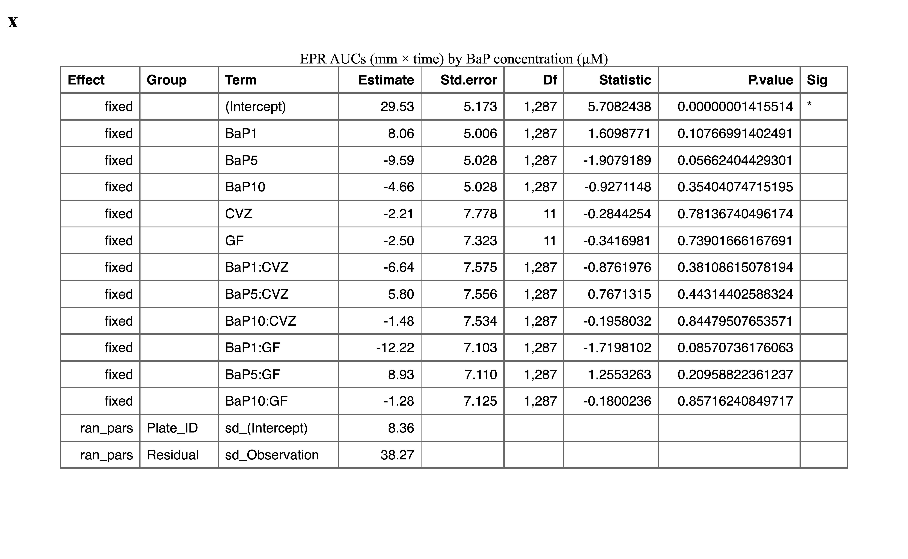

As expected from previous work, we saw statistically significant effects
of B*a*P exposure on the movement of embryonic zebrafish. In particular
there was a strong positive association between B*a*P exposure and total
movement.

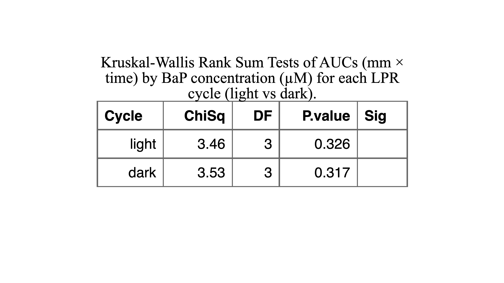

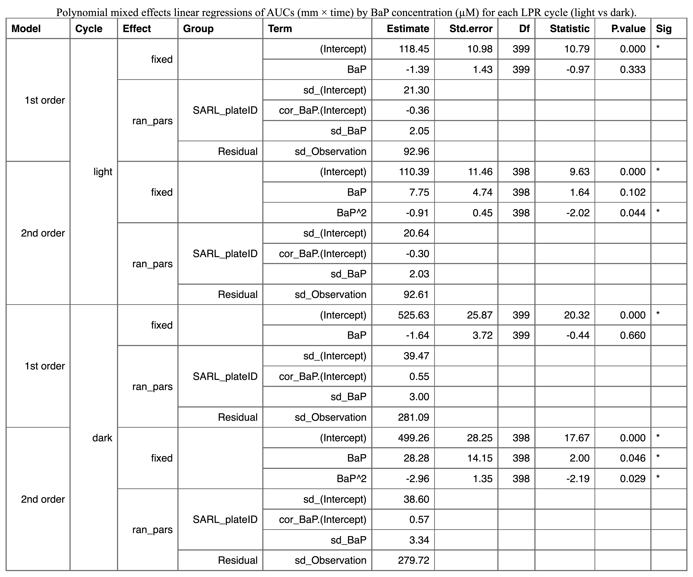

For the LPR assay, we calculated AUCs for their movement on a per-larva
and per-cycle basis (i.e., each larva has an AUC for all dark and all
light cycles). We also included the ID of the 96-well plate that the
larvae were grown in as a random effect in each model. We found
something a little different than expected for the LPR assay, given the
results of the EPR assay. According to the Kruskal-Wallis tests and
first-order mixed effects linear regressions, there was no statistically
significant effect of B*a*P on either dark- or light-cycle AUCs.
However, second-order mixed effects linear regressions revealed a
significant association between the square of B*a*P concentration and
larval movement, implying, perhaps that exposure at the highest
concentration of B*a*P that we evaluated (10 µM) might have had greater
detrimental effects than just inducing hyperactivity and result in
impaired movement for some larvae.

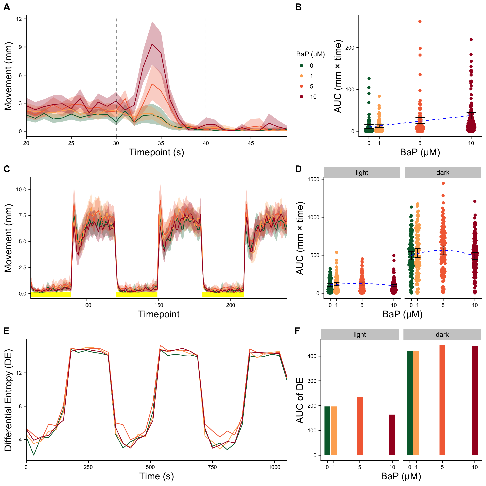

> [Full size](Plots/bapOnly_epr_lpr.png). (A) EPR movement data. The
> lines show the mean movement (mm) for zebrafish embryos for each B*a*P
> exposure level (in µM). The shaded ribbons indicate 95% C.I.s for the
> means. The black dotted lines indicate the window of time on which
> later statistical analysis are based. (B) Areas under the curve (AUCs)
> for the movement curves from panel A, measured only in the window
> between the dotted lines. Black error bars indicate the 95% C.I.s for
> the mean AUC per B*a*P exposure level. The blue dotted line indicates
> the estimated association from linear regression. (C) LPR movement
> data. The lines show the mean movement (mm) for zebrafish larvae for
> each B*a*P exposure level (in µM). The shaded ribbons indicate 95%
> C.I.s for the means. The yellow segments near the x-axis indicate
> which time points fall within light cycles (the rest of the time
> points are in dark cycles). (D) AUCs for the movement curves from
> panel C, splite by cycle. Black error bars indicate the 95% C.I.s for
> the mean AUC per B*a*P exposure level. The blue dotted line indicates
> the estimated association from polynomial linear regression. (E)
> Differential Entropy values (DE; log-transformations of difference in
> 95th and 5th percentiles of movement per treatment per plate). Each
> line represents the sum of the mean DE at each time point for each
> treatment \[Σ(mean(DE) \~ B*a*P µM) \~ plate\]. (F) Plot of the sum of
> AUC values calculated from DE against B*a*P exposure level for all
> light and dark cycles.

## Effects of B*a*P on the zebrafish microbiome

In order to test the effects of B*a*P exposure on the alpha-diversity of
the larval zebrafish gut microbiome, we ran mixed effects linear
regression models predicting five different alpha-diversity metrics from
B*a*P exposure level. As with the behavior assays, we compared both
first-order and second-order models and discarded the second-order model
if it was not a significant improvement over the first-order model,
according to an ANOVA test.

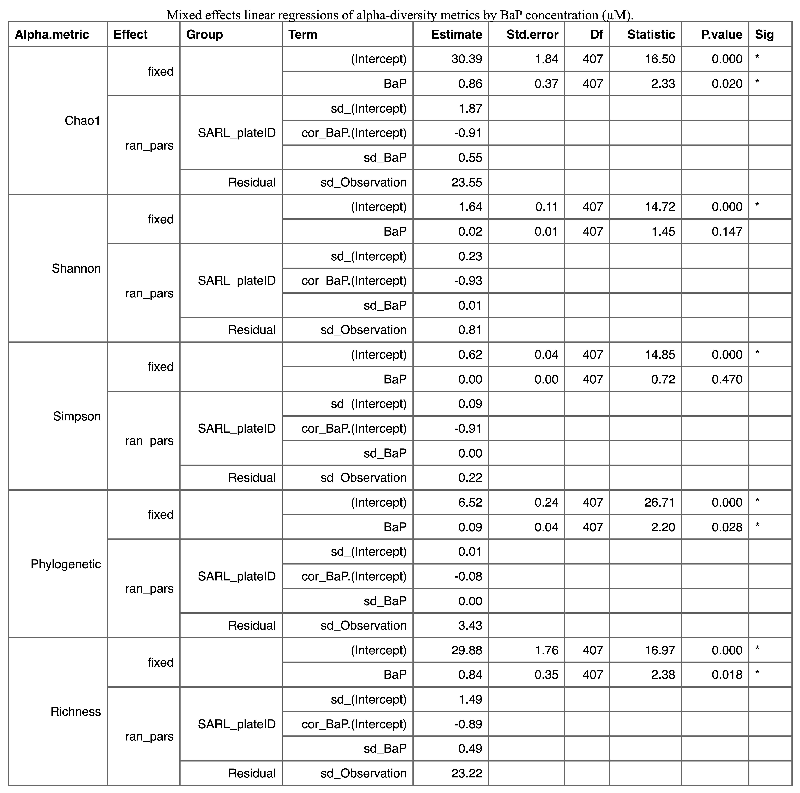

Unlike with the EPR and LPR assays, a second-order B*a*P term did not
improve the regression models prediction of alpha-diversity. We did see,
however, significant positive associations between diversity and B*a*P
exposure level for three of the five alpha-diversity metrics assessed,
namely Chao1, Phylogenetic diversity, and ASV richness. The fact that
B*a*P exposure increased alpha-diversity of the zebrafish gut microbiome
has been documented previously {methods manuscript}. One possible
explanation may be that only certain microbiome constituents can
metabolize a polycyclic aromatic hydrocarbon such as B*a*P, and this
microbes are otherwise very low in abundance in the zebrafish intestine.

We then used permutational ANOVA (PERMANOVA), with plate ID conditioned
out, to determine whether B*a*P exposure level predicts differences in
microbiome composition (beta-diversity) of the larval zebrafish
microbiome. As with previous analyses, both first- and second-order
models were assessed.

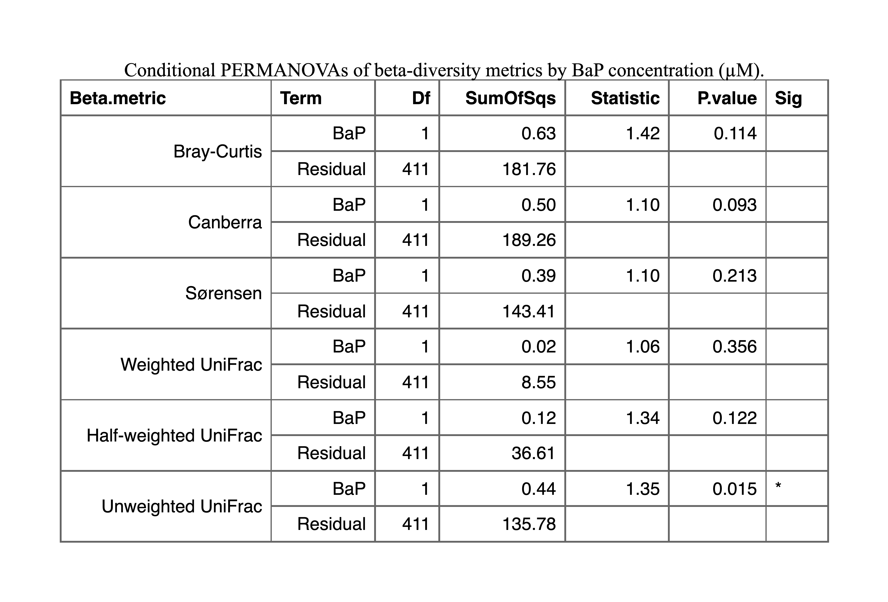

Only one beta-diversity metric, unweighted UniFrac, had a significant
association with B*a*P exposure level. This implies that the ways in
which B*a*P effects the composition of the gut microbiome is likely by
impacting rarer members of the gut microbiome (as we surmised above),
and that these microbes are likely not (relatively) closely related to
microbes found in unexposed zebrafish gut microbiomes.

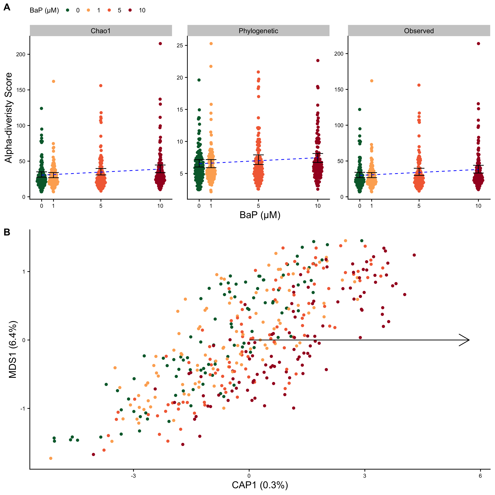

> [Full size](Plots/bapOnly_alpha_beta.png). (A) Significant
> associations between alpha-diversity metrics and B*a*P exposure (in
> µM). Black error bars indicate the 95% C.I.s for the mean
> alpha-diversity score per B*a*P exposure level. The blue dotted lines
> indicate the estimated association from linear regression. (B)
> Distance-based redundancy analysis (dbRDA) ordination based on
> unweighted UniFrac scores. Points are colored by B*a*P exposure level
> and the black arrow indicates the direction of change across the
> ordination and the relative magnitude of the effect.

## Predicting B*a*P exposure from taxon abundances

We utilized two sets of rarefied taxon counts, ASVs-only and ASVs plus
aggregations into taxonomic assignments, to generate both regression and
classification random forest models, for a total of four models. We
split these two data sets into training and test sets (70/30), so we
could assess the accuracy of the models. For whichever data set
(ASV-only vs aggregated) generated the better model, we then assessed
with taxa were statistically significantly important for predicting
B*a*P exposure.

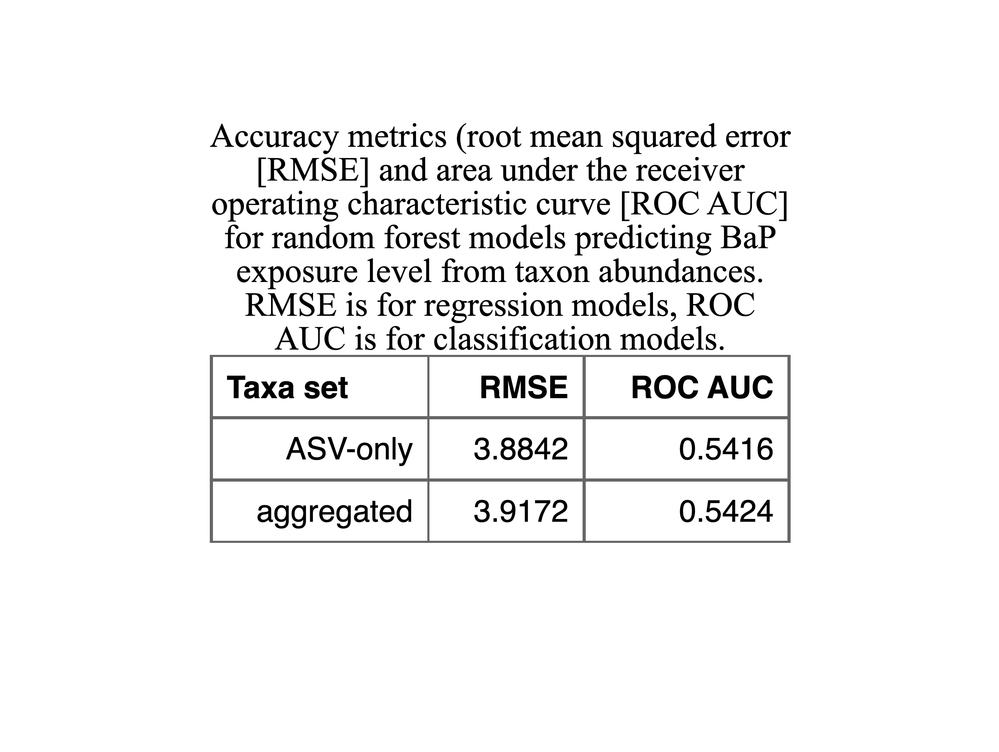

For regression random forest models, lower root mean square (RMSE) is
better, while for classification models, greater area under the receiver
operating characteristic curve (ROC AUC) is better. In these cases we
see that the better regression model, ASV-only, is able to predict B*a*P
exposure level to within about 3.88 µM. The better classification model,
using the aggregated taxon set, is roughly 54% accurate in classifying
B*a*P exposure level, which, since there are four classes (0, 1, 5, and
10 µM), is not perfect, but better than chance.

We then used a permutational approach to determine which taxa were
significantly important in predicting B*a*P exposure. There were 58 ASVs
that were significantly important to the regression model, and 503 taxa
significantly important to the classification model. We plotted the
abundances of the top 20 most important taxa for the classification
model. Tables of all important taxa for both models are in the
supplement.

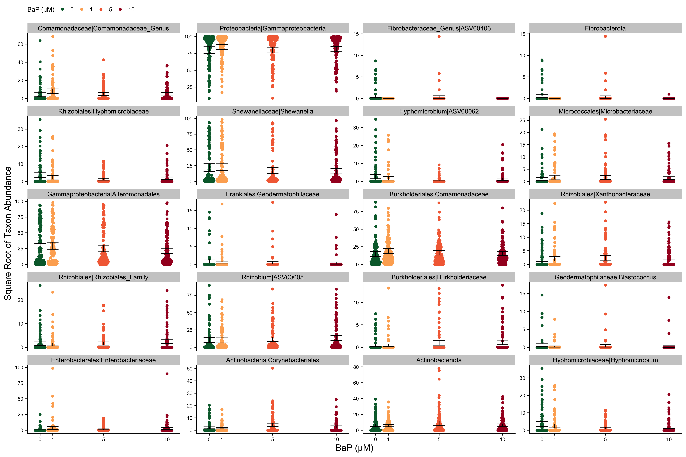

> [Full size](Plots/bapOnly_rf_class_top20impt.png). Abundances by B*a*P
> exposure level for the top 20 unique most important taxa for the
> classification random forest model predicting B*a*P exposure from
> taxon abundances. Black error bars represent the 95% C.I. around the
> mean of the square root of the abundance.

We had hypothesized, from the alpha- and beta-diversity results so far,
that B*a*P exposure increased the abundance of certain (possibly
distantly related) rare taxa. We cannot quantitatively assess the
relatedness of the taxa here, just compare the taxonomic assignments.
But we do see a number of different trends. Certain taxa follow our
hypothesized trend that certain taxa which are relatively rare in
unexposed zebrafish increase in abundance with B*a*P exposure. These
taxa include Xanthobacteriacae, Rhizobiales, Rhizobium,
Burkholderiacaea, and possibly Enterobacteriaceae. However, nearly all
all the other taxa shown in these plots exhibit what appears to be a
non-linear relationship between abundance and B*a*P exposure. Taxa such
as a Comamonadaceae, Gammaproteobacteria, Microbacteriaceae, and
Alteromonadales have their highest abundances in zebrafish exposed to 1
µM B*a*P. Other taxa, such as two Hyphomicrobium phylotypes have their
highest abundances in unexposed larvae, but their lowest in larvae
exposed to 5 µM B*a*P. Still others exhibit even more complex patterns,
such as the Fibrobacterota phylum (and an ASV within that phylum) that
are only present in unexposed larvae and larvae exposed to 5 µM B*a*P,
but no present above detection levels in larvae exposed to either 1 or
10 µM B*a*P.

These plots, of course, give us a very small snapshot of the way that
abundances of various taxa are changing across B*a*P treatments, so it
is difficult to draw very specific conclusions. Is does appear though,
that there is not one or even two straightforward effects of B*a*P on
the larval zebrafish intestinal microbiome.

## Effects of B*a*P **and** the microbiome on zebrafish behavior

For the remainder, we will focus on the LPR assay results. EPR assay
analyses will be in the supplement.

### Alpha-diversity

We first wanted to determine if there was any interaction between B*a*P
exposure level and microbiome alpha-diversity on the behavior of larval
zebrafish. The idea here is that we know B*a*P affects behavior, but do
those effects differ in any way dependent on the microbiome?

Only Shannon has a significant interaction.

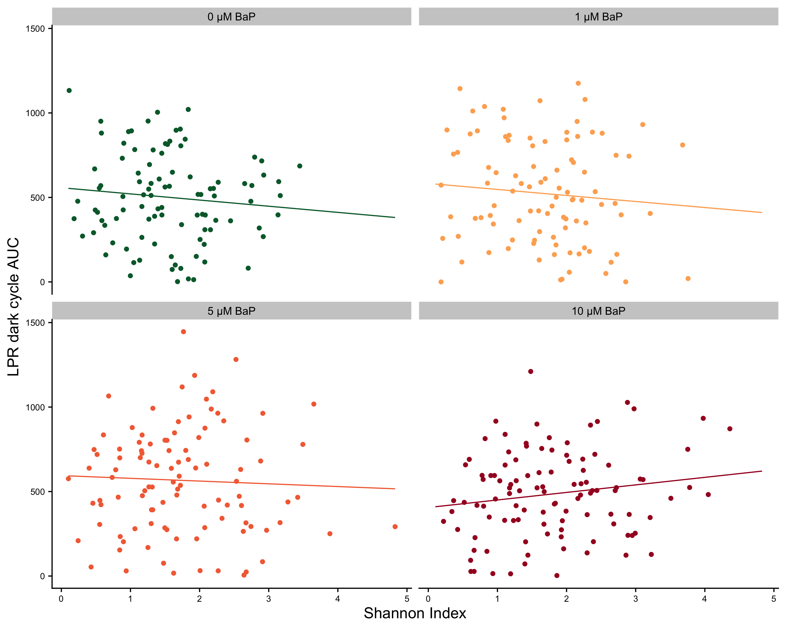

> [Full size](Plots/bapXbehav_alpha.png). Scatter plots of LPR dark
> cycle AUCs by Shannon index score separated by B*a*P exposure level.
> Lines indicate linear regression estimate.

The relationship between alpha-diversity (Shannon index) and LPR dark
cycle AUCs is negative or neutral for all exposure levels, except 10 µM
B*a*P, for which the relationship is positive. This implies that, at the
highest B*a*P expsoure level, larval zebrafish with greater microbiome
diversity exhibit greater levels of hyperactivity than zebrafish with
lower microbiome diversity. This could be due to:

-   the presence of certain taxa that are exacerbating the effects of
    B*a*P in high-diversity microbiomes
-   lower diversity microbiomes are so because they are dominated by
    taxa that are metabolizing B*a*P and making it less toxic
-   at the highest level of B*a*P we looked at, zebrafish are actually
    quite sick and they are *hypo*active relativel to control fish.
    These fact that the fish are unhealhty may be reflected in their
    low-diversity microbiomes.

I think option 3 makes the most sense, both parsimoniously and from
visual inspection of the plots.

### Beta-diversity

Unfortunately, we don’t have a good statistical model to include
beta-diversity as a predictor, only as a response. So we conducted a
*similar* type of model selection as with alpha-diversity, but in this
case, dissimilarity matrices were used as the response variable with
B*a*P exposure and LPR movement AUCs and their interaction as predictor
variables.

First, we considered full models, with all predictor terms included.

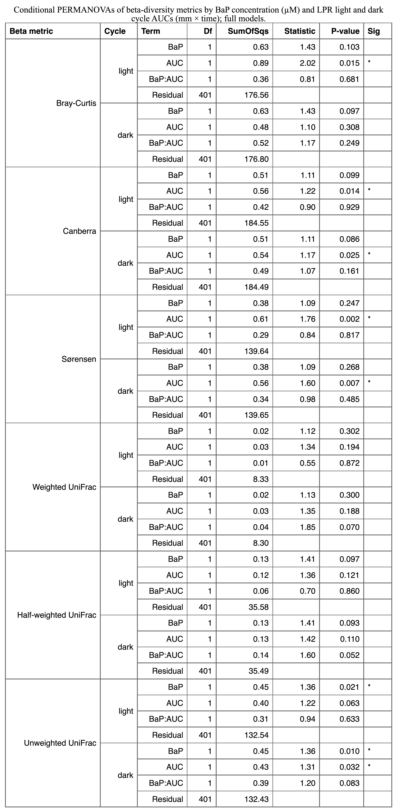

There were no significant interactions between B*a*P exposure level and
LPR AUCs. So we ran a model optimization algorithm to select the best
model (per AIC) for each beta-diversity metric.

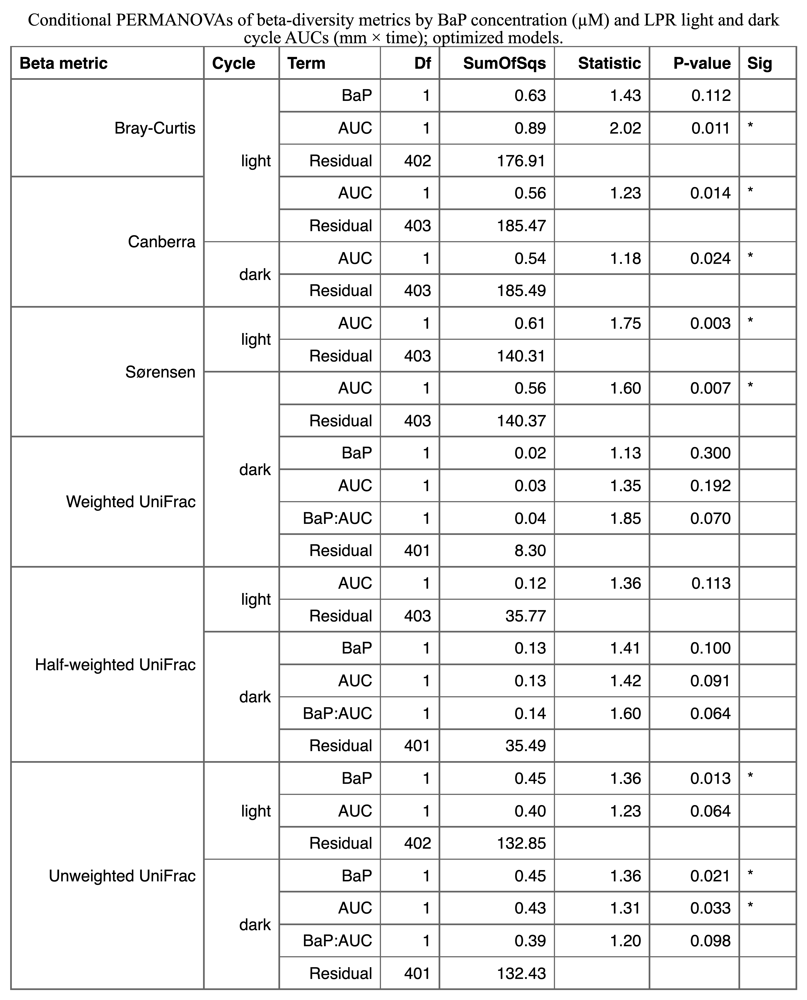

Previously, when we tested whether there was a significant effect of
B*a*P exposure on differences in microbiome composition, we discovered
there was only a significant association for unweighted UniFrac. Here,
we see that, while there are no significant interactions between B*a*P
exposure and LPR movement AUCs, we do see a number of significant
associations between beta-diversity and behavior. For the
phylogenetic-based metrics (UniFrac), we only see a significant
association between unweighted UniFrac scores and LPR dark cycle AUCs.
For the taxonomic-based metrics, both Canberra and Sørensen had
significant associations with AUCs for both LPR cycles, while for
Bray-Curtis, it was only significantly associated with light cycle AUCs.
Of note, the B*a*P exposure by LPR dark cycle AUC interaction term was
retained in the optimized models for all three UniFrac metrics, but was
not statistically significant in any of them. {not sure yet how to
interpret this…}

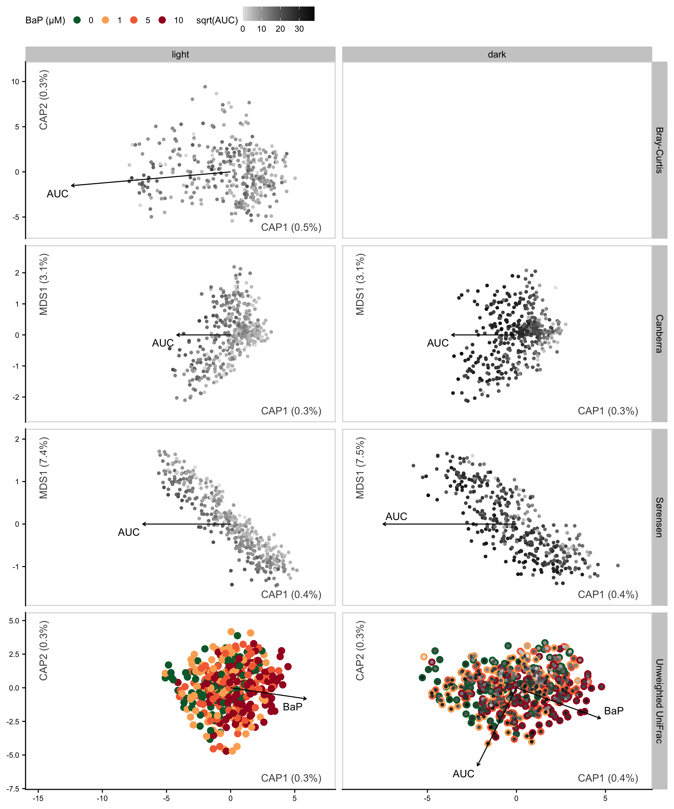

> [Full size](Plots/bapXbehav_beta.png). dbRDA ordinations of zebrafish
> microbiome beta-diversity metrics. Each row depicts ordinations for
> the beta-diversity metric specified on the right side of the plots.
> The ordinations in the left column include constraints from the LPR
> light cycles, while ordinations in the right column include contraints
> from the LPR dark cycles. Blank plots (i.e., Bray-Curtis dark cycles)
> are thusly because only one of the cycles (i.e., Bray-Curtis light
> cycles) had statistically significant associations with either AUCs or
> B*a*P exposure. Greyscale coloring of points indicates the square-root
> (for visualization purposes) of the LPR AUC for the individual points.
> Green to red coloring of the points indicates what level of B*a*P
> exposure the individual samples were exposed to. Black arrows indicate
> the direction and relative magnitiude of the associations between
> microbiome composition and AUC and/or B*a*P exposure. Points are
> colored and arrows are only present if the association was deemed
> statistically significant by a PERMANOVA test.

## Predicting behavior from taxon abundances.

As we did for predicting B*a*P exposure from taxon levels we also used
random forest models to predict LPR cycle AUCs from individual taxon
abundances

From the best random forest model for each cycle, we grabbed the
significantly important taxa for predicting LPR cycle AUCs, and used
mixed effects linear models to assess which taxa signficantly associated
with behavior, regardless of B*a*P exposure level, and whether any taxa
had significant interactions with B*a*P exposure (i.e., were there any
taxa that had differing relationships with behavior depending on B*a*P
exposure level).

> [Full size](Plots/lprAUCs_lme_mainEffects.png). Scatter plots of LPR
> cycle AUCs by individual taxon abundances. Blue lines indicate
> significant regression lines. Only taxa that had significant main
> effects on LPR cycle AUCs are plotted.

> [Full size](Plots/lprAUCs_lme_interactions.png). Scatter plots of LPR
> cycle AUCs by individual taxon abundances and B*a*P exposure. Lines
> indicate significant regression lines for a given B*a*P exposure
> level. Only taxa that had significant interactions with B*a*P exposure
> in association with LPR cycle AUCs are plotted.

## Mediation

We also performed mediation analysis, wherein we attempted to determine
if any taxa causally mediate the effects of B*a*P exposure on the
behavior of larval zebrafish. Twenty-five taxa significantly did so,
including an ASV (ASV0003) in the Shewanella genus (class
Gammaproteobacteria). This is a potentially intriguing genus of microbes
as certain strains have been shown to have protective affects regarding
the inducement of inflammation in the larval zebrafish intestine by
other microbes {Rolig}. *More…*

-   ACME: average causal mediation effect; the expected difference in
    the potential outcome when the mediator took the value that would
    realize under the treatment condition as opposed to the control
    condition, while the treatment status itself is held constant.
-   ADE: average direct effect; the expected difference in the potential
    outcome when the treatment is changed but the mediator is held
    constant at the value that would realize if the treatment equals a
    particular value of treatment.
-   Total effect: ACME + ADE.
-   Prop. Mediated: proportions mediated; the size of the average causal
    mediation effects relative to the total effect

## Network (SpiecEasi) results

*Need to decide whether to include network graphs here*
